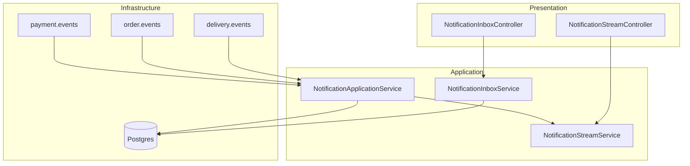

# food-notification-service — Technical Design Document

## 1. Overview

| Attribute | Value |
|-----------|-------|
| **Service name** | food-notification-service |
| **Bounded context** | Customer notifications (SSE + inbox) |
| **Port (direct)** | 8086 |
| **Database** | PostgreSQL on port **5437** (`food_notification_db`) |
| **Messaging** | Kafka — consumes `payment.events`, `order.events`, `delivery.events` |
| **Stack** | Java 21, Spring Boot 3.3, Spring Security, JPA, Flyway, Spring Kafka, SSE |
| **OpenAPI spec** | [api-spec/notification-spec.yaml](../api-spec/notification-spec.yaml) |

The notification service listens to platform Kafka events, persists user-scoped notifications, pushes them over **Server-Sent Events (SSE)**, and exposes a paginated **inbox** with mark-read (requirements 5.6.1 / 5.6.2).

---

## 2. Scope & boundaries

### In scope

- Kafka consumers for payment, order, and delivery events
- Persist notifications per `recipientUserId`
- `order_recipients` mapping (`orderId` → `customerId`) from payment events
- Live SSE stream per authenticated user
- Paginated inbox and mark-as-read
- Idempotent ingestion via `source_event_id` uniqueness

### Out of scope

- Push notifications (mobile FCM/APNs)
- Email/SMS channels
- JWT validation (gateway validates; service trusts `X-User-Id`)
- Publishing Kafka events (consume-only)

---

## 3. Architecture

| Layer | Package | Responsibility |
|-------|---------|----------------|
| **Presentation** | `presentation.controller` | SSE stream, inbox REST |
| **Application** | `application` | Event handling, stream fan-out, inbox |
| **Infrastructure** | `infrastructure.persistence`, `infrastructure.messaging` | JPA, Kafka listeners |

---

## 4. Data model

### Tables (Flyway V1–V2)

**`notifications`**

| Column | Purpose |
|--------|---------|
| `id` | Notification UUID |
| `recipient_user_id` | Customer inbox owner |
| `order_id` | Related order (nullable for some events) |
| `source_event_id` | Kafka event id — dedup |
| `event_type` | e.g. `PaymentConfirmed` |
| `title`, `body` | Display copy |
| `read_at` | Null = unread |
| `created_at` | Sort key |

**`order_recipients`**

| Column | Purpose |
|--------|---------|
| `order_id` | PK |
| `customer_id` | Customer to notify for order-scoped events |

Registered on first `PaymentConfirmed` / `PaymentFailed` with `customerId`.

---

## 5. Kafka integration

| Topic | Events handled | Recipient resolution |
|-------|----------------|----------------------|
| `payment.events` | `PaymentConfirmed`, `PaymentFailed` | `customerId` on event; registers `order_recipients` |
| `order.events` | `OrderReadyForDelivery` | Lookup `order_recipients` |
| `delivery.events` | `DeliveryAssigned`, `DeliveryPickedUp`, `DeliveryInTransit`, `DeliveryDelivered` | Lookup `order_recipients` |

Consumer group: `food-notification-service`.

Duplicate events skipped via `existsBySourceEventId`.

If no `order_recipients` row exists for order/delivery events, notification is skipped (logged warning).

### Notification copy (examples)

| Event | Title |
|-------|-------|
| `PaymentConfirmed` | Payment confirmed |
| `PaymentFailed` | Payment failed |
| `OrderReadyForDelivery` | Order ready |
| `DeliveryAssigned` | Delivery agent assigned |
| `DeliveryPickedUp` | Order picked up |
| `DeliveryInTransit` | Out for delivery |
| `DeliveryDelivered` | Delivered |

---

## 6. SSE stream

**GET /notifications/stream** — `text/event-stream`

| Event name | When |
|------------|------|
| `connected` | Immediately on subscribe |
| `notification` | After Kafka event persisted for this user |
| (comment) | Heartbeat every 30s |

- Emitter timeout: **30 minutes** (`notification.stream.timeout-ms`)
- In-memory subscriber map per `userId` (single-instance; not clustered)
- Gateway SSE route timeout: 30 minutes — see [ROUTE-notification](../../food-api-gateway/docs/endpoints/ROUTE-notification.md)

---

## 7. Security

| Path | Rule |
|------|------|
| `/notifications/**` | Authenticated — requires `X-User-Id` |
| Actuator, Swagger | PermitAll |

All inbox/stream operations scoped to `X-User-Id`. Mark-read returns **404** if notification not owned by caller.

Gateway: any authenticated role for `/notifications/**`.

See [SECURITY.md](../../docs/SECURITY.md).

---

## 8. Configuration

| Property | Default |
|----------|---------|
| `notification.kafka.topics.payment-events` | `payment.events` |
| `notification.kafka.topics.order-events` | `order.events` |
| `notification.kafka.topics.delivery-events` | `delivery.events` |
| `notification.stream.timeout-ms` | `1800000` |
| `notification.stream.heartbeat-interval-ms` | `30000` |
| DB | `localhost:5437/food_notification_db` |

---

## 9. Related services

| Service | Relationship |
|---------|--------------|
| [food-payment-service](../../food-payment-service/docs/TDD.md) | Publishes `payment.events` |
| [food-order-service](../../food-order-service/docs/TDD.md) | Publishes `order.events` |
| [food-delivery-service](../../food-delivery-service/docs/TDD.md) | Publishes `delivery.events` |
| [food-api-gateway](../../food-api-gateway/docs/TDD.md) | JWT, SSE proxy, long timeout |

Platform: [ARCHITECTURE.md](../../docs/ARCHITECTURE.md).

---

## 10. Testing

- Unit + integration tests (EmbeddedKafka, Testcontainers Postgres)
- JaCoCo gate: 80% (`mvn verify`)
- Platform E2E: `scripts/e2e-test.sh` — SSE `connected`, inbox alerts, mark-read
- Tune cold Kafka: `E2E_NOTIFICATION_WAIT=25`
